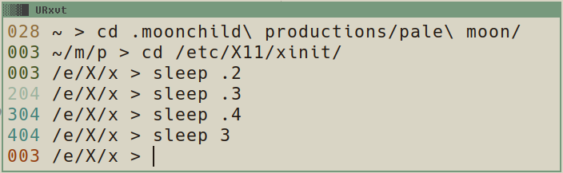

  
 
All videos related to prompt customization can be found in the playlist: [making a prompt with bud]

---

save the file `prompt.sh` at a good location, Then add the following line to your `~/.bashrc`:  

```shell
source PATH_TO_WHERE_YOU_SAVED_THE_FILE/prompt.sh
```

To start using the prompt, you need to re-source .bashrc in your open terminals (`source ~/.bashrc`) or open a new terminal.  

---

### official GNU prompt control documentation:  
<https://www.gnu.org/software/bash/manual/html_node/Controlling-the-Prompt.html>  

### timer function:  
<https://stackoverflow.com/a/1862762>  

### the ternary case:  
<https://unix.stackexchange.com/questions/65310/case-how-to-implement-equal-or-less-or-greater-in-case-syntax>  

### regex character classes and brace expansion:  
<https://www.gnu.org/software/grep/manual/html_node/Character-Classes-and-Bracket-Expressions.html>  

### DEBUG trap:  
<https://www.davidpashley.com/articles/xterm-titles-with-bash/>    

### tput:  
<http://www.linuxcommand.org/lc3_adv_tput.php>    

[making a prompt with bud]: https://www.youtube.com/playlist?list=PLt6-rPpOpkb1jlQc2JJMrXs-qi_wvSL2J
